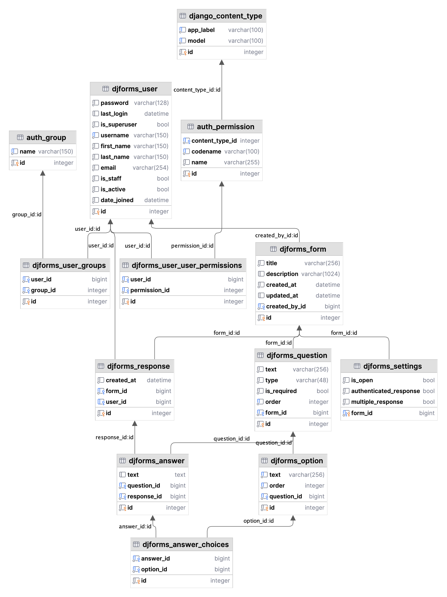

# DjForms

DjForms is a web application to create and share customizable forms, and easily analyse the data collected.

This is my final project for the [CS50’s Web Programming with Python and JavaScript](https://cs50.harvard.edu/web/2020) course.

Check out a quick demo on YouTube: [Watch Demo](https://youtu.be/cEQfyvEYsio)

## Distinctiveness and Complexity

This project stands out from all other projects in the course due to its unique nature. It is not a wiki, e-commerce platform, messaging tool, or social network (nor is it based on the old CS50W Pizza project). Instead, it focuses on customizable forms that can be created within the web app, shared with others, and used to collect and analyze data.

Furthermore, it exhibits a higher level of complexity compared to other projects in the course for the following reasons:

- The Django views are notably larger and more intricate, involving the generation of substantial CSV files through streaming.
- It employs six models in addition to User, incorporating 1-to-1, 1-to-many, and many-to-many relationships, custom serialization, and model forms.
- The project includes custom template filters and a considerable number of reusable partials, along with reusable HTML5 templates.
- The form edit page operates as a single-page application, making asynchronous requests to backend endpoints with a client.
- The form edit page strictly adheres to the MVC pattern and is entirely implemented using ES6 classes, including event-bound callbacks.
- It implements custom browser validation for required checkbox groups and utilizes various Bootstrap resources, such as modals and toasts.
- The project features extensive validation at the database, backend, and frontend levels, ensuring proper error handling and feedback messages.

### Requirements

- [x] As demonstrated previously, it is sufficiently distinct from the other projects in the course, and more complex than those.
    - [x] It is not a social network.
    - [x] It is not an e-commerce.
- [x] Utilizes Django (including at least one model) on the back-end and JavaScript on the front-end.
- [x] It is mobile-responsive.
- [x] This `README.md` file include a writeup describing the project, including all of the following:
    - [x] The **Distinctiveness and Complexity** section.
    - [x] What’s contained in each file created.
    - [x] How to run the application.
    - [x] Additional information about the project.
- [x] Python packages that need to be installed in order to run the web application were added to the `requirements.txt`.
- [x] The `README.md` has more than 500 words.

## Domain context

The forms in this application encompass a variety of question types, including:

- Short text
- Long text
- Single choice (radio buttons)
- Multiple choice (checkboxes)

Questions can be marked as required or optional. In the case of questions with selectable options, each option must be unique. Respondents are the individuals who provide answers to the form and may respond to the form anonymously or with identification, according to the form settings.

## Key features

This application offers a range of key features, including:

- Form customization at any point in time.
- The ability to temporarily pause the acceptance of responses.
- Support for authenticated and multiple responses from respondents.
- Various question types, such as short and long text, radio buttons, and checkboxes.
- Exporting responses in CSV format.

## Design decisions

The design of this application is driven by the following principles and decisions:

- Adhering to the stack covered by the course, while deliberately avoiding the use of Django REST framework and other external resources.
- Opted for custom solutions instead of relying on Django's serializers, model formsets, and other Django resources to provide greater flexibility.
- Intentionally limited the feature set to ensure simplicity, which includes a few question types, absence of bulk deletion capabilities, and drag-and-drop for reordering.

Technical debts:

- The absence of automated tests.
- Lack of token-based authentication for API endpoints.

## File structure

### Backend

The backend works on top of [Django](https://github.com/django/django),
a Python framework for building web applications.

The following are some of the most important files in the backend:

- `admin.py`: definitions for the admin interface.
- `forms.py`: model forms used for validation.
- `models.py`: domain models used to make migrations.
- `urls.py`: web and API routes of the application.
- `util.py`: helper functions.
- `views.py`: web and API controllers.

### Frontend

Pages are server-side rendered with the use of Django's templates in `templates/djforms`, which may [include](https://docs.djangoproject.com/en/4.2/ref/templates/builtins/#include) reusable templates in `templates/partials`.

Nonetheless, the form editing page extensively relies on client-side operations,
executing asynchronous requests to the API endpoints defined in the backend.
This aspect qualifies this section as a single-page application.
It is also based on the MVC pattern.

It does not utilize React or analogous frameworks.
Instead, it is exclusively built using Vanilla ES6,
complemented with styles from
[Bootstrap](https://github.com/twbs/bootstrap).

The frontend is organized into the followed layers:

- **model:** stores data of the form and its settings, including validation.
- **view:** renders the form inputs and the controls to manage the form.
- **controller:** acts as an intermediary between the view and the model.

For more details, refer to the JSDoc comments.

### Template tags

Some custom template filters are defined in `templatetags` accordingly to the [documentation](https://docs.djangoproject.com/en/4.2/howto/custom-template-tags):

- `bootstrap_alert`: converts [Django's message tags](https://docs.djangoproject.com/en/4.2/ref/contrib/messages/#message-tags) to [Bootstrap's alert contextual classes](https://getbootstrap.com/docs/5.3/components/alerts).
- `answer_question`: filters the answer for a given question.
- `answer_option`: filters the chosen option for a given question.

## Database

The relational database structure is defined by the Django's migrations.



Forms have questions, which may have options in case of radio or checkbox types. The answer model has a nullable text field which is filled when the question type is short or long text. In case of checkbox or radio types, choices are recorded. This is an exclusive-or (XOR) relationship.

## How to run

### Environment

Create a virtual environment and activate it.

macOS / Linux:

```shell
python3 -m venv .venv
. .venv/bin/activate
```

Windows:
    
```shell
py -3 -m venv .venv
.\.venv\Scripts\activate
```

### Application

Make migrations:

```bash
python3 manage.py makemigrations
```

Migrate:

```bash
python3 manage.py migrate
```

Create superuser:

```bash
python3 manage.py createsuperuser
```

Run server:

```bash
python3 manage.py runserver
```

### PyCharm configuration

The PyCharm Professional provides Django support. It should work out of the box, having the Django framework and the corresponding Python interpreter properly installed on the machine.

More information: [PyCharm Django Support](https://www.jetbrains.com/help/pycharm/django-support7.html#enable-support)